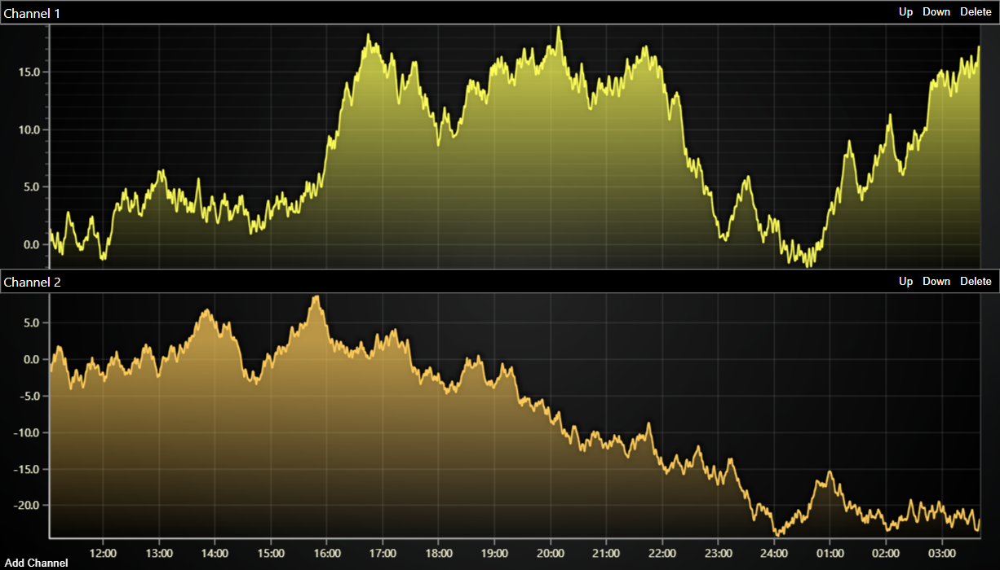

# JavaScript Multi Channel Layout Dashboard



This demo application belongs to the set of examples for LightningChart JS, data visualization library for JavaScript.

LightningChart JS is entirely GPU accelerated and performance optimized charting library for presenting massive amounts of data. It offers an easy way of creating sophisticated and interactive charts and adding them to your website or web application.

The demo can be used as an example or a seed project. Local execution requires the following steps:

-   Make sure that relevant version of [Node.js](https://nodejs.org/en/download/) is installed
-   Open the project folder in a terminal:

          npm install              # fetches dependencies
          npm start                # builds an application and starts the development server

-   The application is available at _http://localhost:8080_ in your browser, webpack-dev-server provides hot reload functionality.


## Description

Example of commonly required layout with several channels, shared time axis and HTML interoperation.

The use case is:

-   Multiple channels each on own Y axis (different units, measurements, value ranges)
-   Shared time view (X axis)
-   Requirement to have user interface controls for every channel, in this example there are:
    -   Move up button
    -   Move down button
    -   Delete channel button
-   Channels can be dynamically added or removed
-   Many charts which can be scrolled up/down in view. Shared time view stays always visible (Sticky X axis)

The example shows how it is possible to creatively interoperate with normal HTML rendered content along side the charts even with this kind of complicated layout.
In this example, the HTML content is created with JavaScript APIs, but in real applications likely a framework such as React, Angular or Vue would be used to render this content.
Even so, the same logic can be applied.

The base idea is that HTML content is positioned based on ChartXY layout which is reported using `layoutchange` event.
Afterwards, the ChartXY layout is adjusted to make space for the HTML content depending on its height.

Sounds complicated, but really its just these few lines of code:

```js
const handleLayoutChange = (event) => {
    const position = event.axes.get(axisY)
    if (!position) return
    headerDiv.style.bottom = `${position.top}px`
    // 2) Allocate space between Y axes of the chart, based on the size of the HTML UI.
    axisY.setMargins(0, headerDiv.getBoundingClientRect().height)
    event.userChangedLayout()
}
```

This is made possible by the convenience of `layoutchange` event, which supplies very detailed information about the positioning of axes and other elements of the chart and is fired automatically whenever this layout changes.


## API Links

* [XY cartesian chart]
* [Axis]


## Support

If you notice an error in the example code, please open an issue on [GitHub][0] repository of the entire example.

Official [API documentation][1] can be found on [LightningChart][2] website.

If the docs and other materials do not solve your problem as well as implementation help is needed, ask on [StackOverflow][3] (tagged lightningchart).

If you think you found a bug in the LightningChart JavaScript library, please contact sales@lightningchart.com.

Direct developer email support can be purchased through a [Support Plan][4] or by contacting sales@lightningchart.com.

[0]: https://github.com/Arction/
[1]: https://lightningchart.com/lightningchart-js-api-documentation/
[2]: https://lightningchart.com
[3]: https://stackoverflow.com/questions/tagged/lightningchart
[4]: https://lightningchart.com/support-services/

© LightningChart Ltd 2009-2022. All rights reserved.


[XY cartesian chart]: https://lightningchart.com/js-charts/api-documentation/v7.0.1/classes/ChartXY.html
[Axis]: https://lightningchart.com/js-charts/api-documentation/v7.0.1/classes/Axis.html

